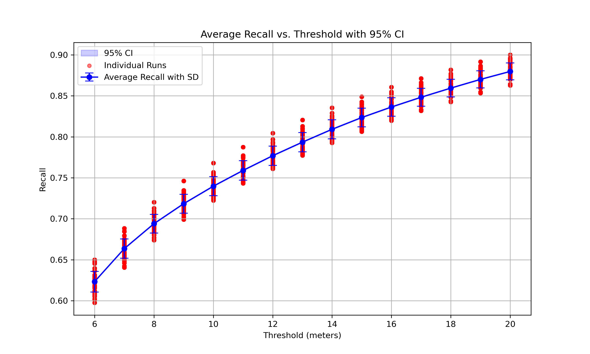

# GreenCity Tree Location: Urban Tree Detection with VGG-16

This repository implements a VGG-16 based baseline model for urban tree detection, part of the GreenCity capstone project. The model processes high-resolution aerial imagery (e.g., NAIP data at 0.6m/pixel) to predict tree locations via confidence maps and peak finding. It supports training and inference on GPU-enabled environments.

Key features:
- Modified VGG-16 Fully Convolutional Network (FCN) with ~33.6M parameters.
- Multi-GPU training support (up to 8 GPUs).
- Evaluation metrics focused on Recall and Average Distance to Closest Predicted Tree.

For more details, see the [original inspiration repo](https://github.com/jonathanventura/urban-tree-detection).

## Data
- **Pasadena Street Trees Dataset**: ~57,000 street trees with geo locations and other attributes.
  - Source: [City of Pasadena Open Data](https://data.cityofpasadena.net/datasets/593b88391b614123890f54a1db8fbf55_0/about)

- **Training Images Dataset**: Preprocessed 256x256 RGB tiles from Pasadena NAIP imagery.
  - Source: [pasadena_data_256_RGB_train_backup/images](pasadena_data_256_RGB_train_backup/images)

- **Inference Demo Input Images**: 2048x2048 tiles with 32-pixel overlap for demonstration.
  - Source: [pasadena_tiles_2048_32/images](pasadena_tiles_2048_32/images)


## Docker Image
We provide a Dockerfile for building a GPU-enabled Docker image based on NVIDIA TensorFlow.

- [Dockerfile](DockerImage/Dockerfile)
- [README for Docker](DockerImage/README.md)

### Build the Docker Image
```bash
docker build -t greencity-tree-location .
```

### Run the Docker Image
```bash
docker run --gpus all --ipc=host --ulimit memlock=-1 --ulimit stack=67108864 -it -v $HOME:/workspace/data greencity-tree-location
```

(Image also available on Docker Hub: [https://hub.docker.com/r/fengchenucb/greencity-tree-location](https://hub.docker.com/r/fengchenucb/greencity-tree-location).)
```
docker pull fengchenucb/greencity-tree-location
```

## Apptainer Image
For HPC environments (e.g., Lawrencium cluster), we provide an Apptainer definition file.

- [Apptainer.def](DockerImage/Apptainer.def)
- [README for Apptainer](DockerImage/README_Apptainer.md)

### Build the Apptainer Image
```bash
sudo apptainer build greencity-tree-location.sif Apptainer.def
```

### Run the Apptainer Image
```bash
apptainer shell --nv --bind $HOME:/workspace/data greencity-tree-location.sif
```

(Image also available on Apptainer Hub: [URL to be provided later].)

## Usage Inside the Image (Docker or Apptainer)
Once inside the container:
1. Navigate to your mounted data directory.
2. Clone the repo (if not already cloned).
3. Run the demo scripts for training/inference using our pretrained model.

```bash
cd /workspace/data

git clone https://github.com/fengchenUCB/greencity-tree-location.git

cd /workspace/data/greencity-tree-location

# Train and infer on demo dataset (multi-GPU)
bash run_gpu_train_inference-demo.sh

# Infer using pretrained model (multi-GPU)
bash run_gpu_pretrained_inference-demo.sh
```

- [run_gpu_train_inference-demo.sh](run_gpu_train_inference-demo.sh)
- [run_gpu_pretrained_inference-demo.sh](run_gpu_pretrained_inference-demo.sh)

These scripts utilize all available GPUs for faster processing.


## Pretrained Weights
Pretrained model weights for VGG-16, fine-tuned on Pasadena data.

- [pasadena_train_weights-demo](pasadena_train_weights-demo)

Place the weights in the appropriate directory (e.g., `./weights/pretrained_rgb`) before running inference demos.


## Pretrained Model Evaluation
Our pretrained model achieves:
- Best Recall: 81% (at 12m threshold)
- Best Average Distance to Closest Predicted Tree: 4.5 meters

- Visualization: [Average Recall vs. Threshold Plot](viz/average_recall_threshold_plot.png)
  - 
- Data: [Average Recall vs. Threshold CSV](viz/average_recall_threshold_data.csv)

For more on the model's structure (21 layers, ~33.6M parameters) and evaluation, see the scripts in the repo.